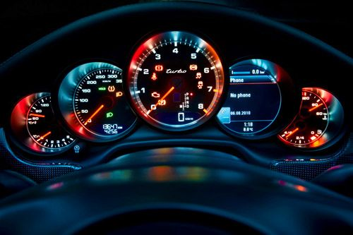
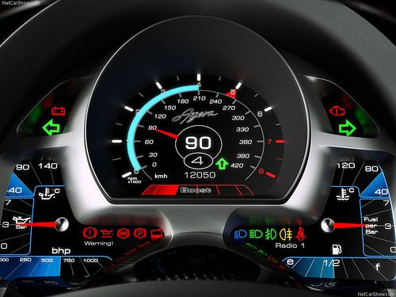
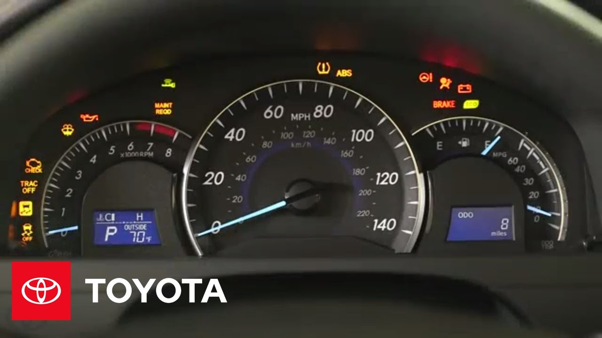
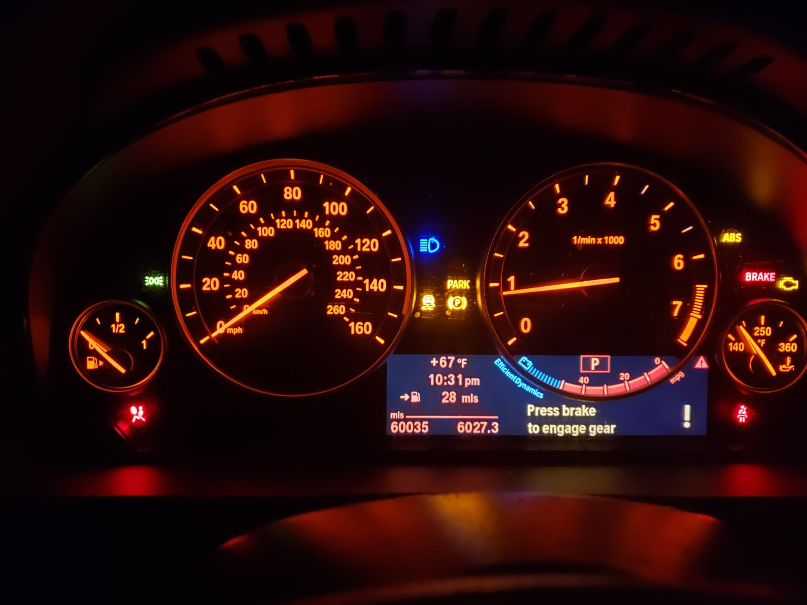

# Example Designs

## Examples of Car Dashboards 
### Dashboard 1
|  | Pros and Cons |
|------------------- | --------------- |
### Dashboard 2

### Dashboard 3

### Dashboard 4

### Dashboard 5

# Creating a New Design

## Most common uses/ rare uses

## Controls used

## New Design Sketch
